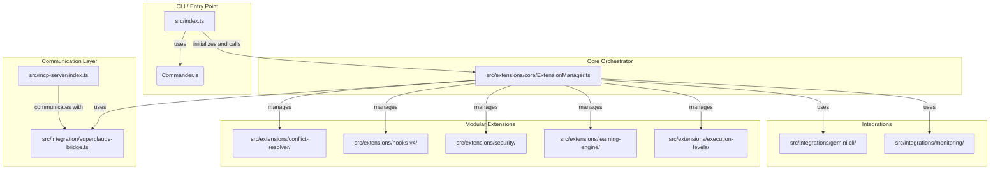

# SuperClaude Enterprise Architecture (Code Analysis Based)

## 1. 개요 (Overview)

`SuperClaude-Enterprise`는 TypeScript로 작성된 Node.js 애플리케이션으로, **명령어 처리(Commander.js)**, **모듈식 확장 관리**, 그리고 **외부 서비스(Claude/Gemini)와의 연동**이라는 세 가지 주요 축을 중심으로 설계되었습니다. 아키텍처의 핵심은 `ExtensionManager`라는 중앙 컨트롤러를 통해 각 모듈의 기능을 오케스트레이션하는 것입니다.

## 2. 아키텍처 다이어그램 (Code-Level)

## 3. 주요 컴포넌트 상세 분석

### 3.1. 애플리케이션 진입점 및 명령어 처리 (`src/index.ts`)

*   **역할**: CLI(Command Line Interface)의 메인 진입점입니다.
*   **구현**: `commander` 라이브러리를 사용하여 `run`, `test-conflict`, `status` 등 다양한 CLI 명령어를 정의하고 사용자의 입력을 파싱합니다. 애플리케이션 시작 시, 가장 먼저 핵심 컨트롤 타워인 `ExtensionManager`를 초기화하고, 파싱된 명령어에 따라 `ExtensionManager`의 적절한 메서드를 호출하여 실제 로직을 수행시킵니다.

### 3.2. 핵심 컨트롤 타워 (`src/extensions/core/ExtensionManager.ts`)

*   **역할**: 모든 확장 기능과 외부 연동 모듈을 총괄하고 오케스트레이션하는 중앙 컨트롤러입니다. 이 시스템의 두뇌 역할을 합니다.
*   **구현**: 
    *   생성자(Constructor)에서 `ConflictResolver`, `GeminiAdapter`, `HookManager`, `SecurityLayer` 등 모든 핵심 모듈의 인스턴스를 생성하며 의존성을 주입합니다.
    *   `executeCommand` 메서드는 명령어 실행의 전체적인 파이프라인을 관리하며, 다음과 같은 순서로 동작합니다.
        1.  **보안 계층 적용**: `SecurityLayer`를 통해 컨텍스트(명령어, 옵션 등)를 안전하게 처리합니다.
        2.  **실행 레벨 결정**: `ExecutionLevelManager`를 통해 명령어의 위험도를 평가하고 실행 여부 또는 방식을 결정합니다.
        3.  **페르소나 충돌 해결**: `ConflictResolver`를 호출하여 여러 페르소나 간의 의견 충돌을 해결하고 최종 실행 계획을 확정합니다.
        4.  **백엔드 선택**: `GeminiAdapter`를 통해 비용과 성능을 고려하여 Claude 또는 Gemini AI 백엔드를 동적으로 선택합니다.
        5.  **명령어 실행**: `SuperClaudeBridge`를 통해 최종적으로 SuperClaude 코어에 명령어를 전달하여 실행합니다.
        6.  **학습**: `LearningEngine`을 통해 실행 결과를 다음 추천을 위한 학습 데이터로 저장합니다.

### 3.3. 모듈식 확장 기능 (`src/extensions/`)

각 하위 디렉토리는 독립적인 기능을 수행하는 플러그인 형태의 모듈로, `ExtensionManager`에 의해 관리됩니다.

*   **`conflict-resolver`**:
    *   **역할**: 여러 페르소나의 역할이 충돌할 때 해결 전략을 제공합니다.
    *   **구현**: `PriorityBasedStrategy`(우선순위 기반), `NegotiationStrategy`(협상), `VetoStrategy`(거부권) 등 다양한 전략 클래스를 포함합니다. `ConflictResolver` 클래스가 상황에 맞는 최적의 전략을 선택하여 적용합니다.
*   **`hooks-v4`**:
    *   **역할**: Claude Code의 훅(Hook) 시스템과 연동하여, 명령어 실행 전후에 특정 로직(유효성 검사, 자동 포맷팅 등)을 실행합니다.
    *   **구현**: `HookManager`가 `.claude/settings.json`에 정의된 훅 설정을 읽어와, `PreToolUse`, `PostToolUse` 등의 이벤트에 맞춰 등록된 스크립트를 실행합니다.
*   **`security`**:
    *   **역할**: 시스템의 보안을 강화합니다.
    *   **구현**: `SecurityLayer` 클래스가 민감 정보(API 키 등)를 마스킹하고, 위험한 명령어 패턴을 필터링하며, 감사 로그(Audit Log)를 남기는 기능을 제공합니다.

### 3.4. 외부 서비스 연동 (`src/integrations/`)

*   **`gemini-cli`**:
    *   **역할**: Google Gemini API와의 연동을 담당합니다.
    *   **구현**: `GeminiAdapter` 클래스는 `selectBackend` 메서드를 통해 컨텍스트의 크기, 파일 수 등을 분석하여 Claude API와 Gemini API 중 어느 것이 더 비용 효율적인지 판단하는 핵심 로직을 포함합니다.

### 3.5. MCP 서버 (`src/mcp-server/`)

*   **역할**: Claude Code와 실시간으로 통신하는 MCP(Model Context Protocol) 서버 역할을 합니다.
*   **구현**: `@modelcontextprotocol/sdk`를 사용하여 MCP 서버를 구현합니다. `natural_language_command`와 같은 도구를 외부에 노출하여, Claude Code가 사용자의 자연어 입력을 이 서버로 전달하면, 서버는 이를 분석하여 정형화된 SuperClaude 명령어로 변환하고 실행 계획을 다시 Claude Code에 제안하는 방식으로 상호작용합니다.

## 4. 결론

`SuperClaude-Enterprise`는 중앙 집중식 오케스트레이터(`ExtensionManager`)가 각 기능별로 명확하게 분리된 모듈(확장, 통합, 통신)을 제어하는 현대적인 **마이크로서비스 지향 아키텍처**를 채택하고 있습니다. 이를 통해 각 기능의 독립적인 개발과 테스트가 용이하며, 새로운 기능을 추가하거나 기존 기능을 수정할 때 시스템 전체에 미치는 영향을 최소화할 수 있는 유연하고 확장 가능한 구조를 가지고 있습니다.